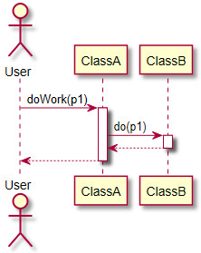

# SeqDiagBuilder

Generates a UML sequence diagram on Python code using data collected at execution time.

## Principle

SeqDiagBuilder does its job in two steps:
1. It first collects control flow data during program execution.
2. Using the collected control flow data, it generates a PlantUML sequence diagram command file.

Then, PlantUML can be launched on the generated command file to draw the sequence diagram, storing it in an svg file. The svg file can be opened in a web browser to display the diagram.

Step 1 requires the insertion of a single line of code in the leaf or lowest level methods which are to be displayed in the sequence diagram.

The code to insert is
...

    from seqdiagbuilder import SeqDiagBuilder
    ...

    SeqDiagBuilder.recordFlow()


## Example
Here's a very basic usage of SeqDiagBuilder followed by the generated
PlantUML command file and the sequence diagram drawned from it.

#### ClassA
```
class ClassA:
    '''
    '''
    def doWork(self, p1):
        '''
        :param p1:
        :return:
        '''
        b = ClassB()
        b.do(p1)
```
#### ClassB
```
class ClassB:
    def do(self, p1):
        '''

        :param p1:
        :return:
        '''
        from seqdiagbuilder import SeqDiagBuilder
        SeqDiagBuilder.recordFlow()
```
#### Code using SeqDiagBuilder
```
import os, inspect, sys

currentdir = os.path.dirname(os.path.abspath(inspect.getfile(inspect.currentframe())))
parentdir = os.path.dirname(currentdir)
sys.path.insert(0, parentdir)

from seqdiagbuilder import SeqDiagBuilder
from doc.classa import ClassA

def createSeqDiagram():
    a = ClassA()
    currentdir = os.path.dirname(os.path.abspath(inspect.getfile(inspect.currentframe())))

    SeqDiagBuilder.activate(projectPath=currentdir, entryClass='ClassA', entryMethod='doWork')

    a.doWork(1)

    SeqDiagBuilder.createDiagram(targetDriveDirName='c:/temp', actorName='User')
    SeqDiagBuilder.deactivate()

if __name__ == '__main__':
    createSeqDiagram()
```
#### Generated PlantUML command file
```
@startuml

actor User
participant ClassA
participant ClassB
User -> ClassA: doWork(p1)
	activate ClassA
	ClassA -> ClassB: do(p1)
		activate ClassB
		ClassA <-- ClassB:
		deactivate ClassB
	User <-- ClassA:
	deactivate ClassA
@enduml
```
#### Generated sequence diagram


Later in this document, more detailed and complete informations on
SeqDiagBuilder usage is provided. In the end, a section is devoted to
the inner working and implementation of SeqDiagBuilder in order to
facilitate its extension / improvement by any motivated developer.

## Usage

### SeqDiagBuilder tags
* **:seqdiag_return** This tag can be added anywhere in the method doc to specify the return type to attach in the sequence diagram to the call of this method
* **:seqdiag_select_method** Used in the context where a method is defined at different levels in a class hierarchy. This tag is useful only if the classes of the hierarchy are defined in the same file ! In this case, SeqDiagBuilder selects by default the parent class method (the one at the highest level in the hierchy. Use this tag anywhere in the method doc to override the default.
* **:seqdiag_note** Used either in class or in method doc. Use \r to force a line break. But a better solution is to specify maxSigArgNum=None, maxSigCharLen=30 for example when calling SeqDiagBuilder.createSeqDiaqCommands() or SeqDiagBuilder.createDiagram().
## Installing PlantUML

Download plantuml.jar from http://plantuml.com/starting
• To be executed, plantUML requires Java to be installed !

Running PlantUML on a command file

java -jar plantuml.jar -tsvg plantUML_commands_file

## Required libraries
